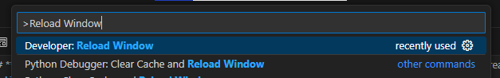
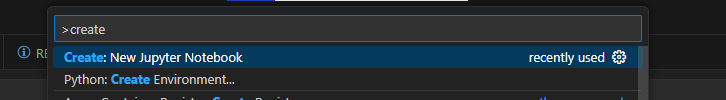
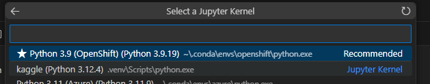
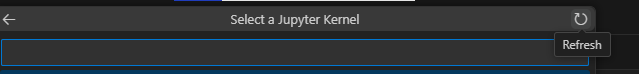

**Kaggle Skill Challenge - Used Car Price Prediction**
======================================================

**Introduction**
---------------

Welcome to this blog post, where we will embark on a exciting journey to predict used car prices using a Kaggle competition. This project aims to evaluate our skills in building a simple machine learning model to predict the prices of used cars. We will start by setting up a local environment, and then deploy our solution to Kaggle.

**Setup Local Environment**
---------------------------

To get started, we need to set up a local environment that meets the requirements of our project. Follow these steps to create a virtual environment, install necessary packages, and set up a Jupyter Notebook.

### 1. Create a Virtual Environment

Open a terminal and create a virtual environment using Python 3.12.4:
```bash
python -m venv .venv
```
This will create a virtual environment named `.venv`.

### 2. Activate the Virtual Environment

Activate the virtual environment:
```bash
.venv\Scripts\activate.bat
```
On Linux, you can use `source .myenv/bin/activate` to activate the environment. To deactivate, simply type `deactivate`.

### 3. Install ipykernel

Install ipykernel:
```bash
pip install ipykernel
```
### 4. Create a New Kernel

Create a new kernel to be used for your project:
```bash
python -m ipykernel install --user --name=kaggle
```
This will create a kernel named `kaggle`.

However, this kernel is not automatically added to your VS Code kernel list.
To refresh the kernel list in VS Code, you need to reload the VS Code window. 
Using the command palette by pressing `Ctrl + Shift + P` (Windows/Linux) or `Cmd + Shift + P` (Mac) and typing `Reload Window`




### 5. Install Jupyter Notebooks

Install Jupyter Notebooks:

```bash
pip install jupyter
```

This will allow you to work with Python in Jupyter Notebooks.

### 6. Install Jupyter Notebook Extension (Optional)

If you are using VS Code, install the Jupyter Notebook Extension by opening the Command Palette (Ctrl+Shift+X) and typing `Jupyter`, then click install.

### 7. Create a Jupyter Notebook

Create a new Jupyter Notebook by running the `Create: New Jupyter Notebook` command from the Command Palette (Ctrl+Shift+P):



This will create a new `.ipynb` file in your workspace.
Then you can save it `ctrl+s` and save it with the name of `notebook`
### 8. Select the kernel in VS Code

After reloading the VS Code window, follow these steps to select the `kaggle` kernel:

1. Open a new Jupyter Notebook or an existing one in VS Code.
2. Click on the kernel selector in the top right corner of the Jupyter Notebook.
4. Select Another Kernel
4. Select Jupyter Kernel
3. You should see a dropdown list of available kernels.
4. Select the `kaggle` kernel from the dropdown list.



 If you don't see the `kaggle` kernel, try clicking on the "Refresh Kernels" button.



### 9. Installation of libreries
python -m pip install -U matplotlib
